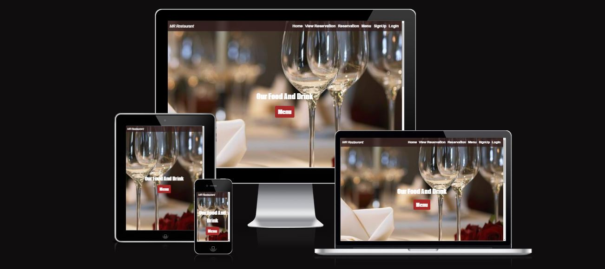
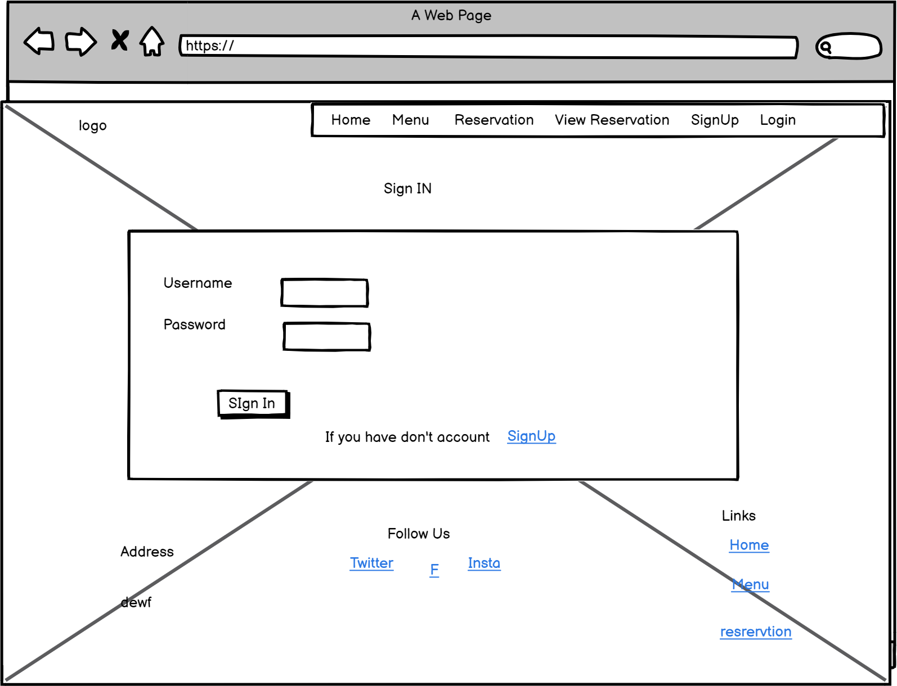
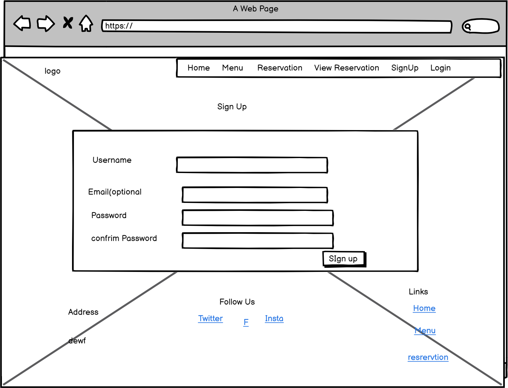
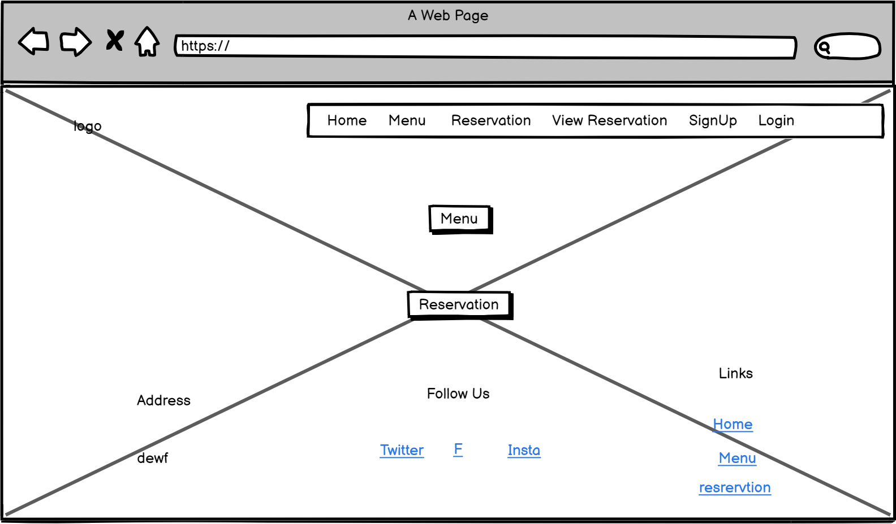
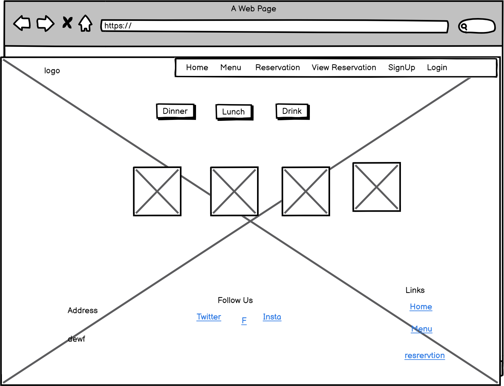
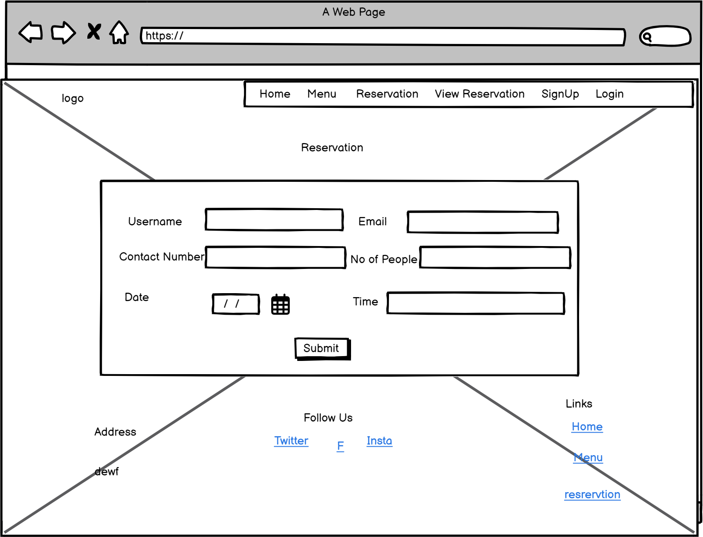
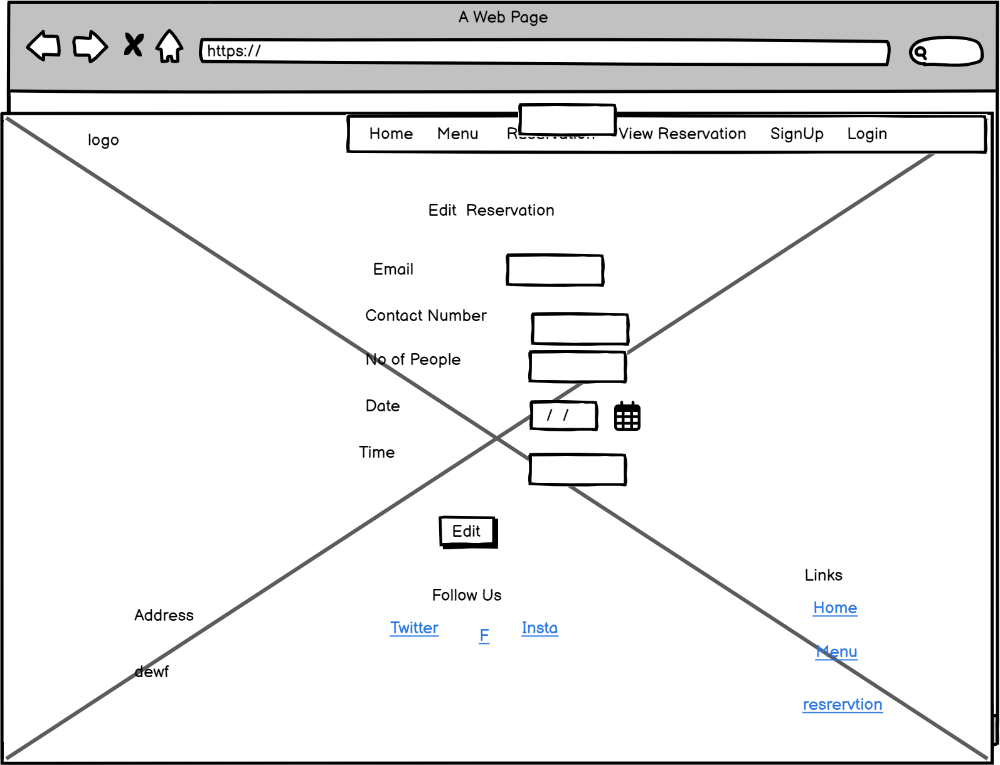
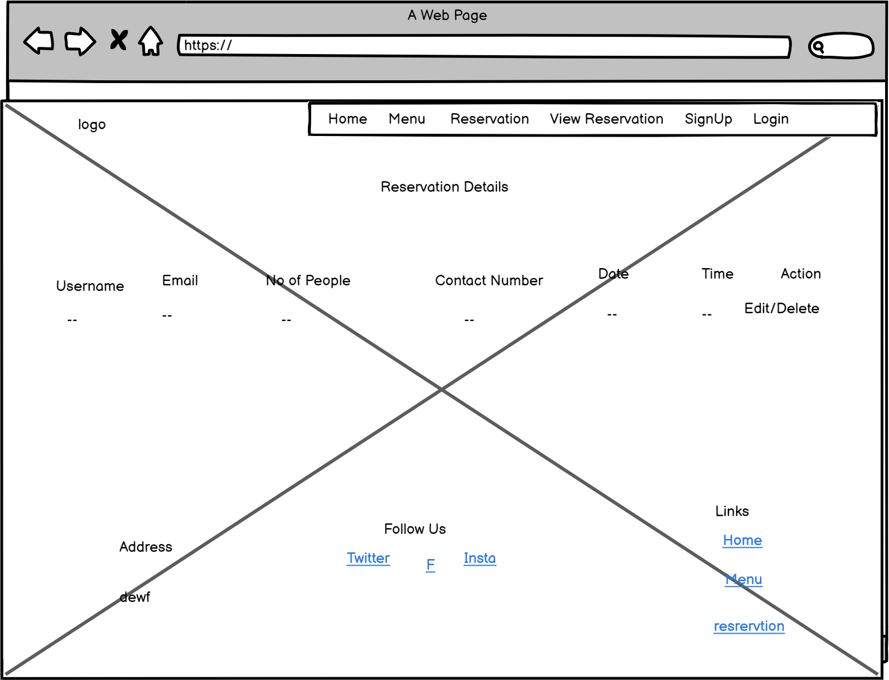
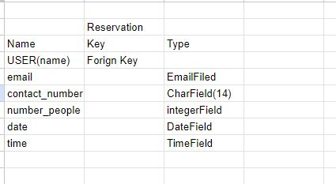

# Resturtant Reservation

## Introduction ##

I've developed a restaurant reservation website. Users can view the menu for lunch and dinner. They can book reservations for a specific date and time, ensuring they can't select past dates. Only future and current dates are selectable. Additionally, users can delete and edit their reservations.

## User Personas ##

- A family wants to spent time together with delicious food.
- A person wants to go with his firends for dinner or lunch. 

## User Stories ##

* I have designed the user stories outlined in my [GitHub project](https://github.com/users/meena-rathi/projects/2).
* I followed the agile methodology to implement my project using GitHub Projects.
* Each user story has its own acceptance criteria.

The user storys in my GitHub project are as follows:

* As a site user, I can easily create an account to access the website.
* As a site user, I can make a reservation for a table on the current date or future dates so that I have a reservation.
* As a site user, I can see my reservation.
* As a site user, I can edit or delete my reservation.
* As a site admin, I can create, delete, and update reservations.

## User Goals ##

New User: 

- I can navigate the website without any hassle.
- The website provides enough information for me to understand what the restaurant is about.
- The sign-up process is easy and straightforward.

Pervious user:

- Signing in is easy.
- I can view and manage my bookings easily.

## Website Owner Goals

- Allow users to view, modify, and manage their bookings effortlessly.
- Send timely confirmations and date.
- Design an intuitive layout for easy access to menu.
- Ensure the sign-up process is simple, with minimal steps and clear instructions.

## Design

### Wireframes

These are wire frames of my website.

### Entity Relational Diagram

I have designed the ERD Diagram on th excel sheet.

## Fonts ##

- The 'sans-serif' font family, a sans-serif typeface, has been selected for use across the resturtant project. 

- Font Colors: The color scheme for text is primarily brown, gray and white.

## Features ##

When a user signed In, a message must be displayed.

For reservation and viewing reservations, signing in is mandatory.

- The navigation bar is active and highlights the current page you are on, making navigation easier.
- The navigation bar is responsive, making it convenient for visitors using smaller screens.

- The footer contain the adress and social icon.

- The menu page has three tabs: Lunch, Dinner, and Drinks. Lunch menu is ative when page reload. When a user clicks on the Lunch tab, they see the lunch menu.
- Clicking on the Dinner tab shows the dinner menu, and clicking on the Drinks tab displays the drinks menu.

- When a user creates a reservation, if the email already exists, it should display an error indicating that it is already in use.
- If the user enters a new email, the data should be saved in the database and redirected to view the reservation.

- When a user creates a reservation, if the email already exists, it should display an error message indicating that it already exists. 
- If the user enters a new email, the data is saved in the database and redirected to view the reservation.

- After successfully creating the reservation, the user can edit or delete the reservation here.

- When a user clicks on the delete button, a pop-up alert appears asking, "Are you sure you want to delete?"

- When the reservation is successfully deleted, a message appears confirming the deletion.

- When a user edits the form, if something goes wrong, a message must be displayed.

- When a user edits the form, if something goes wrong, a error must displayed. if not the form edit successfully.

## Deployment & Local Development

### Deployment

- Set up a PostgreSQL server on ElephantSQL.
- Adjusted the settings file to use the ElephantSQL database.
- Set up cloudinary.
- Stored the SECRET_KEY and DATABASE_URL in an env.py file, and added env.py to .gitignore.
- Installed Gunicorn (version 20.1) and added it to requirements.txt.
- Created a Procfile to declare the web process and command to run the project.
- Added a runtime.txt file with the supported Python version, close to the version used in development.
- Set DEBUG to False in the settings file.
- Added Heroku to the ALLOWED_HOSTS in the settings file (with .herokuapp).
- Pushed the code to GitHub.
- Created a new app on Heroku.
- In the app's settings tab, clicked "Reveal Config Vars" and added DATABASE_URL (from ElephantSQL) and SECRET_KEY.
- Connected the Heroku app to the GitHub repository via the deploy tab.
- Clicked "Deploy Branch" to deploy the project.

Here is a link to my Deployed project: [reseturtant reservation](https://resturtantbooking-f16cfcc27fc2.herokuapp.com/)

### Local Development

#### Fork

To fork the repository, follow these steps:

- Log in to your GitHub account (or sign up if you don't have one).
- Navigate to the repository: [reservation](https://github.com/meena-rathi/resturtantbooking)
- Click the "Fork" button located in the top right corner of the page.

#### Clone

To clone the repository:

- Log in to GitHub (or sign up if you don't have an account).
- Navigate to the repository: [reservation](https://github.com/meena-rathi/resturtantbooking)
- Click on the "Code" button, select whether you would like to clone with HTTPS, SSH, or GitHub CLI, and copy the link shown.
- Open the terminal in your code editor and change the current working directory to the location where - you want to clone the repository.
- Type git clone into the terminal, then paste the link you copied in step 3. Press Enter.

## Languages and Frameworks

- This project was created using Django 4.2.1 and Bootstrap 5.3.

- The additional libraries used can be found in the requirements.txt file.
- CSS
- HTML
- JS

## Testing

For details on all testing carried out,[TESTING.md](TESTING.md) please refer to the TESTING.md file.

## Fixed Bugs ##

1. When user made the reservtion the reservation page is not redirecting.
2. Fixed the email validation.
3. Fixed Edit date validation.
4. Fixed contact number validation.

## Credits ##

1. https://stackoverflow.com/questions/31548373/django-1-8-django-crispy-forms-is-there-a-simple-easy-way-of-implementing-a
2. https://pixabay.com/ 
3.  To deisgn Menu (https://www.google.com/search?q=how+to+design+menu+card+for+restaurant+bootstrap+5+code&sca_esv=60b997825705a04a&rlz=1C1CHBD_enPK955PK955&biw=1366&bih=607&sxsrf=ACQVn09aseLtTNtj54HsY9BRUGUIJjSdmA%3A1712300129767&ei=YaAPZvqnLr-Txc8PgZicsAg&oq=how+to+design+menu+card+for+restaurant+bootstrap+5+co&gs_lp=Egxnd3Mtd2l6LXNlcnAiNWhvdyB0byBkZXNpZ24gbWVudSBjYXJkIGZvciByZXN0YXVyYW50IGJvb3RzdHJhcCA1IGNvKgIIATIFECEYoAEyBRAhGKABMgQQIRgVSKYfULkKWOoRcAF4AZABAJgBhwGgAbkCqgEDMi4xuAEDyAEA-AEBmAIEoALKAsICChAAGEcY1gQYsAOYAwCIBgGQBgaSBwMzLjGgB84Q&sclient=gws-wiz-serp#fpstate=ive&vld=cid:c092b7c7,vid:KRENd1sv3tE,st:0)
4. [I think therefore I blog](https://github.com/Code-Institute-Solutions/blog)
5. https://stackoverflow.com/questions/23956288/django-all-auth-email-required
6. https://docs.djangoproject.com/en/4.2/topics/http/urls/

## Acknowledgments ##

I would like to express my gratitude to the following individuals:

- My Mentor, jubril, whose guidance and support have been invaluable.
- Markus, my classmate, who provided significant assistance with my readme file.
- kristyna_ci, whose contributions were immensely helpful throughout the project.
- Thanks to all my classmates who provided feedback about my project. How can I make it even better?