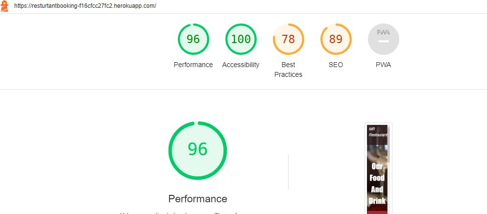

## Testing

### Validation

Python was validated using [PEP8 CI python linter](https://pep8ci.herokuapp.com/), with no errors.

CSS was validated using [jigsaw](https://jigsaw.w3.org/css-validator/#validate_by_input), with no errors or warnings.

HTML was validated using [W3C Validator](https://validator.w3.org/#validate_by_uri), with no errors or warnings.

js was validated using [JS Validator](https://jshint.com/), with no errors or warnings.

### Lighthouse Report

### Automation Testing

I have done only automation testing for the resveration.

### Manual Testing

#### Navbar

| Feature | Expected Outcome | Testing Performed | Result | Pass/Fail |
| --- | --- | --- | --- | --- |
| Logo | redirect to the Home Page| MR icon cliked | Home page | Pass |
| Menu Tabs | redirected to particular paged cliked on the tab | Clicked on th tabs | Page opened as per clicked tab | Pass |

#### Footer

| Feature | Expected Outcome | Testing Performed | Result | Pass/Fail |
| --- | --- | --- | --- | --- |
| Facebook link in navigation| Leads to correct site and opens in a new tab| Clicked on Facebook link|  Facebook page open |Pass |
| Instagram link in navigation | Leads to correct site and opens in a new tab | Clicked on Instagram link | Instagram open  | Pass |
| Twitter link in navigation | Leads to correct site and opens in a new tab | Clicked on Twitter link |Twitter open | Pass |

#### Home Page

| Feature | Expected Outcome | Testing Performed | Result | Pass/Fail |
| --- | --- | --- | --- | --- |
| Menu button| Leads to correct menu page| Clicked on Menu button |  Menu page open |Pass |
| Reservation button|Leads to correct Reservation page | Clicked on Reservation button | Reservation page open |Pass |

#### Menu Page

| Feature | Expected Outcome | Testing Performed | Result | Pass/Fail |
| --- | --- | --- | --- | --- |
| Lunch button| Lunch menu open| Clicked on lunch button | lunch Menu  open |Pass |
| Dinner button| Dinner menu open| Clicked on Dinner button | Dinner menu open |Pass |
| Drink button| Drink menu open| Clicked on Drink button | Drink Menu open |Pass |

#### Reservation Page

| Feature | Expected Outcome | Testing Performed | Result | Pass/Fail |
| --- | --- | --- | --- | --- |
| Sign In| Reservation must be open after login the page | After sign In | Reservation open |Pass |
| Email | Email vaild | Enter email | The email is correct | Pass |
| Email | Email not vaild | Enter email | The email is not correct | Pass |
| Email | Email already registered | Enter email | This email is already registered | Pass |
| Contact Number | The Enter contact Number is valid | Enter contact number | The contact number is correct | Pass |
| Contact Number | The Enter contact Number is not valid | Enter contact number | The contact number is not correct | Pass |
| Date | Only select the current or future date | Select Date | Only select the current or future date | Pass |
| Date | Past Dates not selected | Select Date | user can't select the past Date | Pass |
| reservation Button | All fileds enter valid data | Submit reservation | View reservation page open | Pass |

#### View Reservation

| Feature | Expected Outcome | Testing Performed | Result | Pass/Fail |
| --- | --- | --- | --- | --- |
| Logged User| View the reservation | Logged User | View Reservation | Pass |

#### Delete Reservation

| Feature | Expected Outcome | Testing Performed | Result | Pass/Fail |
| --- | --- | --- | --- | --- |
| Logged User| Delete the Reservation from view Reservation page | Logged User | Delete Reservation | Pass |

#### Edit Reservation

| Feature | Expected Outcome | Testing Performed | Result | Pass/Fail |
| --- | --- | --- | --- | --- |
| logged User| Edit the Reservation from view Reservation page | Logged User | Edit Reservation | Pass |
| Edit  | All filed contain the valid Data | Edit | No error Data updated | Pass |
| Edit  | If any filed is not valid | Edit |  error Data has not been updated | Pass |

